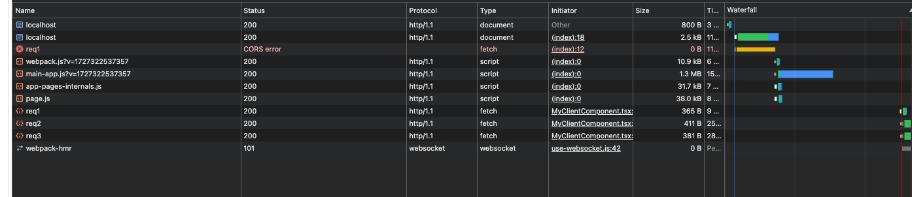
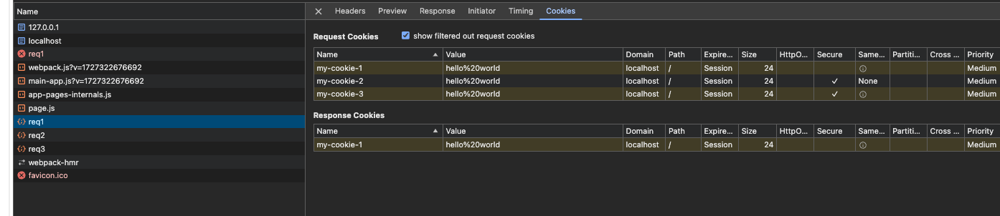

## Instructions:


```
cd next-app
npm i
npm run dev
```

In another terminal

```
npx serve -l 4000
```

Open browser to http://127.0.0.1:4000 (nb! NOT localhost:4000!)

Dev tools -> application -> clear site data

Refresh

Observe the following network graph: 



To note: 

The first `/req1` is a CORS error. This is the request that is made by the outer application - and this demonstrates that CORS functionality is working properly. 

Examine the successful `/req1`, `/req2`, `/req3` requests and observe that they set a cookie. 


Refresh the page and inspect the cookies again - we want to see if the cookies are attached to the requests:

Observe that only `my-cookie-2` is attached - because for this one it has the SameSite=None property set. 




